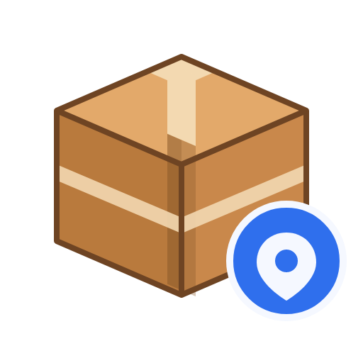
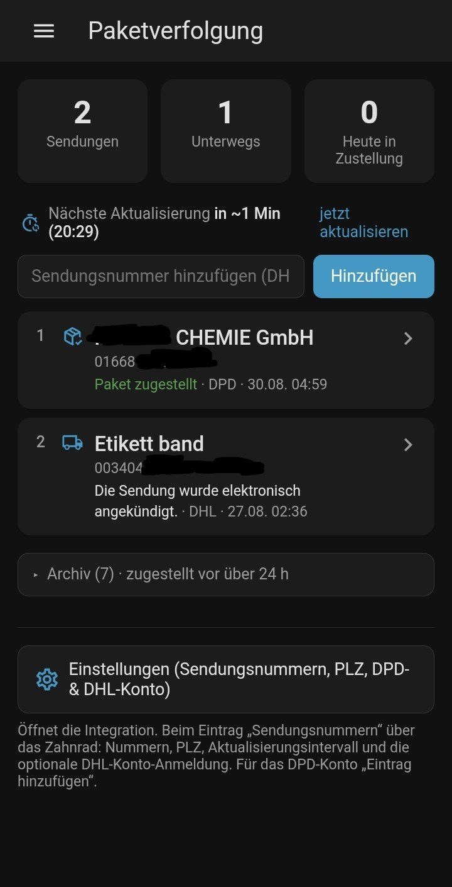

# Paketverfolgung für Home Assistant

Zeigt den Status deiner Paketsendungen als Sensoren und als eigene Seitenleisten-Oberfläche in Home Assistant an. Zwei Wege, die sich beliebig kombinieren lassen:

- **Sendungsnummern** – du trägst Nummern ein, der Anbieter (**DHL**, **DPD** oder **Hermes**) wird pro Nummer automatisch erkannt.
- **DPD-Konto** – Login mit deinem myDPD-Konto, alle Sendungen werden automatisch erkannt.
- **DHL-Konto** (optional) – Login mit deinem DHL-Konto, die Sendungen des Kontos werden automatisch mitgeführt.
- **Amazon.de-Konto** (optional) – Login mit deinem Amazon-Konto, laufende Lieferungen werden automatisch erkannt (inkl. tatsächlichem Zusteller). ⚠️ Sicherheitshinweis unten beachten.

## Installation über HACS

1. HACS öffnen → **Integrationen** → Menü (⋮) → **Benutzerdefinierte Repositories**.
2. Dieses Repository als URL eintragen, Kategorie **Integration** wählen, hinzufügen.
3. „Paketverfolgung“ in HACS suchen und installieren.
4. Home Assistant neu starten.

**Einstellungen → Geräte & Dienste → Integration hinzufügen → „Paketverfolgung“** ausführen und wählen, was du hinzufügen möchtest. „Sendungsnummern“ und „DPD-Konto“ können parallel eingerichtet sein.

> ⚠️ **Hinweis:** Alle genutzten Schnittstellen sind **inoffiziell** (keine dokumentierten APIs). Sie können sich jederzeit ohne Vorwarnung ändern.

## Sendungsnummern (DHL, DPD & Hermes)

1. „Sendungsnummern (DHL, DPD & Hermes)“ wählen.
2. Eine oder mehrere Nummern eingeben (nach jeder Nummer Enter). Der Schritt kann leer übersprungen werden.
3. Optional deine **PLZ** hinterlegen – manche DPD-Sendungen sind ohne Empfänger-PLZ nicht öffentlich abrufbar.

Bei der nächsten Aktualisierung wird jede Nummer der Reihe nach bei DHL, DPD und Hermes nachgeschlagen. Der erkannte Anbieter wird gemerkt und danach nur noch dieser abgefragt.

Liegt die Erkennung mal daneben, lässt sich der Anbieter pro Sendung fest vorgeben – auf der Detailseite in der Oberfläche über das Auswahlfeld „Anbieter", oder per Dienst `paketverfolgung.set_tracking_carrier` (`carrier: dhl` / `dpd` / `hermes` / `auto`).

Jeder Sendung lässt sich ein **eigener Name** geben (Detailseite → Feld „Name", oder Dienst `paketverfolgung.set_tracking_name`) – gilt auch für Sendungen aus dem DPD-Konto. Leeres Feld = Anbieter-Name.

- **DHL:** öffentliche Sendungsverfolgungs-Suche (kein Login), inkl. komplettem Verlauf und Zustellzeitfenster.
- **DPD:** öffentliche „Parcel Life Cycle“-Verfolgung von tracking.dpd.de, inkl. Verlauf.
- **Hermes:** öffentliche Sendungsverfolgung von myhermes.de (v2-API `api.my-deliveries.de`), inkl. Verlauf.

> ℹ️ `tracking.dpd.de` blockt Anfragen aus manchen Rechenzentren/VPS-Netzen (TCP-Reset). Läuft dein Home Assistant auf einem gehosteten Server, funktioniert die **DPD-Nummernsuche** dort evtl. nicht (DHL und Hermes sind nicht betroffen; das DPD-**Konto** liefert weiterhin den aktuellen Status, nur den nachgeladenen Verlauf nicht).

**Nummern später hinzufügen/entfernen:** Zahnrad-Symbol beim Eintrag „Sendungsnummern“ – dort auch PLZ und Aktualisierungsintervall (Standard: 15 Minuten). Oder über den Dienst `paketverfolgung.add_tracking_number` bzw. das Eingabefeld in der Oberfläche.

Eine Nummer, die keinem Anbieter zugeordnet werden kann, bleibt mit dem Status **„In Prüfung“** in der Liste und wird bei jeder Aktualisierung erneut bei allen Anbietern geprüft – solange, bis du sie löschst oder den Anbieter manuell festlegst.

## DPD-Konto

Meldet sich mit deinem **myDPD-Konto** an (SOAP-API der offiziellen DPD-App „Paketnavigator“) und zeigt automatisch **alle** Sendungen (gesendet, empfangen, Retouren) an – keine manuelle Eingabe nötig. Der vollständige Verlauf wird zusätzlich über die öffentliche DPD-Verfolgung nachgeladen; bei geschützten Sendungen hilft die in den Optionen hinterlegte PLZ.

Das Passwort wird nur lokal in Home Assistant gespeichert (wie bei jeder anderen Cloud-Integration).

## DHL-Konto verbinden (optional)

Beim Eintrag „Sendungsnummern“ gibt es im Zahnrad-Menü den Haken **„DHL-Konto verbinden und Sendungen automatisch erkennen“**. Ist er gesetzt, öffnet sich ein Schritt mit einem **DHL-Login-Link**:

1. Link im Browser öffnen, mit dem DHL-Konto anmelden.
2. DHL leitet danach auf eine Adresse weiter, die mit `dhllogin://` beginnt – die Seite bleibt scheinbar leer. Die komplette Adresse aus der Adresszeile kopieren (oder mit `Strg+U` im Quelltext nach `dhllogin://` suchen) und in das Feld einfügen.

Danach werden bei jeder Aktualisierung die **nicht archivierten Sendungen des Kontos** automatisch mit in die Liste aufgenommen (Anbieter = DHL). Es wird **kein Passwort** gespeichert, nur das OAuth-Sitzungs-Token; es wird selbstständig erneuert.

Der Diagnose-Sensor **„DHL-Konto Erkennung“** (`sensor.dhl_konto_erkennung`) zeigt das Ergebnis der letzten Abfrage (`Aus`, `N Sendung(en) erkannt` oder eine Fehlermeldung).

> ℹ️ Die Login-Parameter stammen aus der DHL-App und sind inoffiziell – ändert DHL sie, muss die Anmeldung ggf. neu erfolgen oder die Funktion bricht. Deshalb standardmäßig **aus**.

Idee und OAuth-Flow von [@SniperWCW](https://github.com/SniperWCW) ([#1](https://github.com/Jetiman/Versand-HA/pull/1)) – der PR wurde nicht 1:1 übernommen, sondern das Konzept auf aktuellem Stand neu umgesetzt.

## Amazon.de-Konto (optional)

„Eintrag hinzufügen“ → **„Amazon.de-Konto“** → mit E-Mail und Passwort anmelden (bei aktivierter 2FA folgt ein Schritt für den Einmalcode). Danach werden bei jeder Aktualisierung die **aktuell verfolgbaren Lieferungen** aus deinen Amazon-Bestellungen ausgelesen – mit Status, Trackingnummer, **tatsächlichem Zusteller** (z. B. „Versendet mit DHL“) und dem Amazon-Sendungsverlauf.

> ⚠️ **Sicherheitshinweis:** Es wird zwar **kein Passwort** gespeichert, aber die **Amazon-Sitzung (Cookies)** – im Klartext im Config-Entry und damit auch in Backups. Diese Sitzung erlaubt vollen Zugriff auf dein Amazon-Konto (Bestellungen, Adressen, Zahlungsmittel). Nur einrichten, wenn dir das bewusst ist.

> ℹ️ Kein offizielles API – die Daten werden aus den Amazon-Seiten gelesen. Amazon blockt Logins aus Rechenzentrums-/VPS-Netzen häufig per CAPTCHA (dann klappt die Anmeldung nicht), ändert die Seiten laufend (kann die Erkennung brechen) und automatisiertes Auslesen widerspricht den Amazon-Nutzungsbedingungen.

Konzept aus [#3](https://github.com/Jetiman/Versand-HA/pull/3) von [@SniperWCW](https://github.com/SniperWCW).

## Was wird angezeigt?

Pro Sendung ein Sensor mit:

- **Zustand:** Klartext-Status (z. B. „In Zustellung“, „Zugestellt“)
- **Attribute:** `tracking_id`, `carrier` (`dhl`/`dpd`/`hermes`/`amazon`), `delivery_carrier` (bei Amazon der tatsächliche Zusteller), `group` (Phase), `direction`, `delivered`, `archived` (zugestellt vor über 24 h), `delivered_at` (Zeitpunkt der Zustellung), `tracking_url`, `events` (kompletter Verlauf, neueste zuerst), bei DHL zusätzlich `delivery_window_from`/`_to`

Zusätzlich zwei **anbieterübergreifende** Sammel-Sensoren:

- **„Heute in Zustellung“** (`sensor.heute_in_zustellung`): Zustand ist die Gesamtzahl der Sendungen, die gerade im Zustellfahrzeug sind; Attribut `shipments` enthält die Liste (inkl. Anbieter), `next_update` den nächsten Abfragezeitpunkt.
- **„Nächste Aktualisierung“** (`sensor.naechste_aktualisierung`, Diagnose): Zeitstempel der nächsten Abfrage – HA zeigt das automatisch als „in X Minuten“.

## Oberfläche („Paketverfolgung“ in der Seitenleiste)

Nach der Einrichtung erscheint automatisch ein eigener Menüpunkt **Paketverfolgung**:

- **Übersicht:** Kacheln (Gesamt / Unterwegs / Heute in Zustellung), eine Zeile „Nächste Aktualisierung in ~X Min“ (Klick = sofort aktualisieren), Eingabefeld „Sendungsnummer hinzufügen (DHL, DPD, Hermes)“ und die nummerierte Liste aller Sendungen – zuletzt geändert zuerst, mit Datum und Uhrzeit der letzten Änderung.
- **Archiv:** 24 Stunden nach der Zustellung wandert eine Sendung in den ausklappbaren Bereich „Archiv“ am Ende der Liste (Kacheln und aktive Liste bleiben so übersichtlich). Archivierte Sendungen werden nicht mehr abgefragt, bleiben aber inkl. Verlauf abrufbar. Der Zustellzeitpunkt kommt aus dem Verlauf; fehlt er (z. B. DPD-Konto ohne erreichbaren Verlauf), zählt der Zeitpunkt, an dem HA die Sendung zuerst als zugestellt gesehen hat – dieser wird gespeichert und übersteht Neustarts. Das Sensor-Attribut `archived` zeigt den Zustand auch außerhalb der Oberfläche.
- **Detailseite:** Klick auf eine Sendung → aktueller Status, Eckdaten, Link zur Anbieter-Seite, Buttons „Jetzt aktualisieren“ / „Löschen“, ein **Namensfeld** (eigenes Label statt des Anbieter-Namens), ein Auswahlfeld zum manuellen Festlegen des Anbieters und der **komplette Sendungsverlauf** als Zeitleiste.
- **Einstellungen:** Button am Ende der Übersicht öffnet die Integration – dort beim jeweiligen Eintrag über das Zahnrad PLZ und Sendungsnummern eingeben, oder per „Eintrag hinzufügen“ den DPD-Login.

Reine Weboberfläche ohne zusätzliche Abfragen – zeigt dieselben Daten wie die Sensoren, nur aufbereitet.

## Bekannte Einschränkungen

- Alle Schnittstellen sind inoffiziell und können bei anbieterseitigen Änderungen brechen. Bitte in diesem Fall ein Issue öffnen.
- Hermes: keine automatische Kontoerkennung – Sendungsnummern müssen eingetragen werden. DHL bietet eine optionale Konto-Anmeldung (siehe oben), die aber auf einer inoffiziellen App-Schnittstelle beruht.
- DPD: manche Sendungen sind ohne Empfänger-PLZ nicht öffentlich abrufbar; nur ein myDPD-Konto pro Eintrag. `tracking.dpd.de` ist aus manchen Server-/VPS-Netzen nicht erreichbar (siehe Hinweis oben).
- Hermes: die genutzte Schnittstelle (`api.my-deliveries.de`) ist undokumentiert; falls sich das Antwortformat ändert, fehlt ggf. der Verlauf.
- Amazon: kein API, sondern Auslesen der Bestell-/Trackingseiten. Login scheitert aus VPS-/Rechenzentrums-Netzen oft an einem CAPTCHA; die Sitzung läuft regelmäßig ab und muss dann neu eingerichtet werden; Amazon-Seitenänderungen können die Erkennung brechen. Die Amazon-Sitzungscookies liegen im Klartext im Config-Entry/Backup. Nur ein Amazon-Konto pro Installation.
